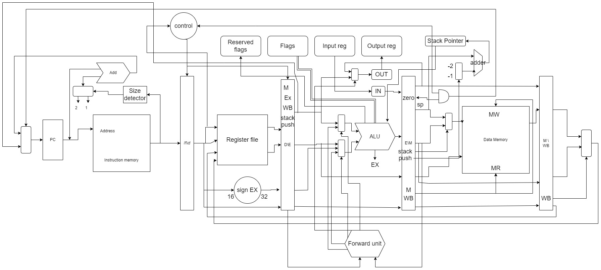
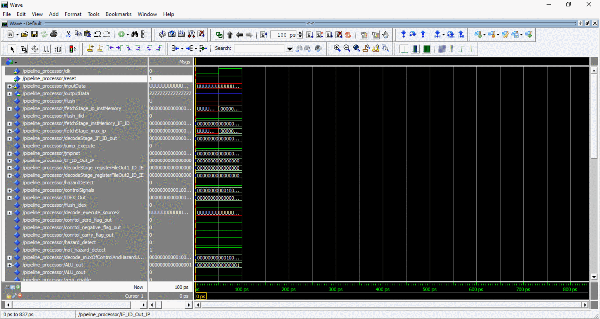

# Pipelined processor
pipeline-based processor simualtion with **VHDL** language, that contains five processing stages:
* Fetch Stage
* Decode Stage
* Execute Stage
* Memory Stage
* Write Back Stage

## Processor Diagram
The initial diagram that changed a lot further 😅

## Simulation
Using modelsim

